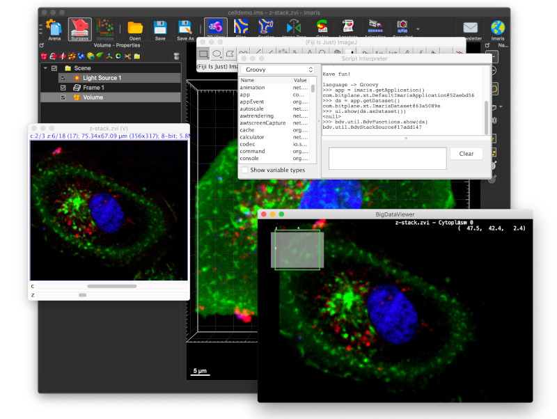

# Imaris-Bridge


## Introduction

Imaris-Bridge exposes Imaris datasets as cached ImgLib2 images. We focus
in particular on big (larger-than-RAM) images, for which both Imaris and ImgLib2
provide sophisticated caching infrastructure. On the ImgLib2 side, the images
are represented as lazily cached tiled images -- image blocks, when they are
first accessed, are retrieved from Imaris through the [*Imaris
XT*](https://imaris.oxinst.com/open/) API and cached.
Modified image blocks are persisted back to Imaris before they are evicted from
the cache. (Imaris then in turn persists modified blocks to disk when they are
evicted from *its* cache). Therefore, Imaris-Bridge provides arbitrarily large,
readable and writable images, that are transparently cached, and shared between
Imaris and Fiji/ImageJ2 without duplicating memory requirements.

Imaris-Bridge exposes the [*Imaris XT*](https://imaris.oxinst.com/open/)
interface as an [ImageJ2 Service](https://javadoc.scijava.org/ImageJ/net/imagej/ImageJService.html?is-external=true).
Note, that this service only covers parts of Imaris XT that are relevant for
image data. (Of course, the ImarisService provides full access to the underlying
Imaris XT proxies. But only the image-related subset is wrapped in a "imglibby"
convenience layer.)

For convenient access to spot detection, surfaces, and other un-related
features, have a look at [*EasyXT*](https://github.com/BIOP/EasyXT-FIJI) from EPFL
BIOP. (EasyXT and Imaris-Bridge can be used concurrently without difficulties.)


### Quickstart

If you have both Imaris and Fiji running (otherwise you won't care...), it's easy
to start playing with Imaris-Bridge:

Open a dataset in Imaris.

In Fiji, activate the update site "Imaris-Bridge".
(See [this guide](https://imagej.net/update-sites/following) for how to activate update sites).

Open the Script Interpreter (via *Plugins>Scripting>Script Interpreter* or shortcut `Shift` + `[`).

In the interpreter, type `app = imaris.getApplication()`.
This tries to establish a connection to Imaris, and should result in something like
```text
>>> app = imaris.getApplication()
com.bitplane.xt.DefaultImarisApplication@1fbb7c15
```
If it fails (for example because no Imaris instance is running), you will get an exception.

To get the image currently opened in Imaris, type `dataset = app.getDataset()`.
This will return an `ImarisDataset`, which wraps the Imaris image.
```text
>>> dataset = app.getDataset()
com.bitplane.xt.ImarisDataset@5b6f26f8
```
`ImarisDataset` caches image data for reading/writing from/to the wrapped Imaris image.
It provides several views on this data: as a plain ImgLib2 `Img`,
as a standard IJ2 `Dataset` with meta-data,
or as multi-resolution BigDataViewer sources.

For example, to show the IJ2 `Dataset` in the Fiji UI, type `ui.show(dataset.asDataset())`.
To show the sources in BigDataViewer, type `bdv.util.BdvFunctions.show(dataset)`.

```text
>>> ui.show(ds.asDataset())
<null>
>>> bdv.util.BdvFunctions.show(ds)
bdv.util.BdvStackSource@17add147
```




## Installation

In Fiji, activate the update site "Imaris-Bridge" `https://sites.imagej.net/Imaris-Bridge`.
(See [this guide](https://imagej.net/update-sites/following) for how to activate update sites).

For developers, the Maven GAV is
```
<dependency>
    <groupId>com.bitplane</groupId>
    <artifactId>imaris-bridge</artifactId>
    <version>9.7.2</version>
<dependency>
```


## Imaris-Bridge API

### Connecting to Imaris

To start, you need an instance of
[ImarisService](http://0.0.0.0:8080/com/bitplane/xt/ImarisService.html).
`ImarisService` connects to the Imaris XT API, giving you access to the running
Imaris instance(s)
([ImarisApplication](http://0.0.0.0:8080/com/bitplane/xt/ImarisApplication.html)).


#### Getting ImarisService
There are several ways to get the `ImarisService`.

If you are writing an ImageJ2 Plugin, you just declare that you need
`ImarisService` by putting an annotated field
```java
@Parameter
private ImarisService imaris;
```
which will be populated for you by the framework.

Similarly, if you are running from a script, put an annotated variable
```text
#@ ImarisService imaris
```

If you are running a stand-alone java application, create a SciJava
[Context](https://javadoc.scijava.org/SciJava/org/scijava/Context.html)
and ask for the `ImarisService`
```java
Context context = new Context();
ImarisService imaris = context.getService(ImarisService.class);
```


#### Getting ImarisApplication
From the `ImarisService` you can get a handle to the running Imaris instance using
```java
ImarisService imaris;
ImarisApplication app = imaris.getApplication();
```

For advanced scenarios, where there are multiple running Imaris instances at the
same time, you can get a list of them using
[ImarisService.getApplications()](http://0.0.0.0:8080/com/bitplane/xt/ImarisService.html#getApplications--),
or get a specific instance by 
[ImarisService.getApplicationByID()](http://0.0.0.0:8080/com/bitplane/xt/ImarisService.html#getApplicationByID-int-),


### ImarisApplication API
[ImarisApplication](http://0.0.0.0:8080/com/bitplane/xt/ImarisApplication.html)
wraps Imaris XT `IApplicationPrx` and represents one particular Imaris instance.

`ImarisApplication` comprises methods that mirror methods of the Imaris XT
`IApplicationPrx` proxy, for creating/getting/showing datasets. You can also use
[ImarisApplication.getIApplicationPrx()](http://0.0.0.0:8080/com/bitplane/xt/ImarisApplication.html#getIApplicationPrx--)
to access the underlying Imaris XT proxy for accessing functionality not covered
by Imaris-Bridge (either directly or through
[*EasyXT*](https://github.com/BIOP/EasyXT-FIJI)).


#### Getting an existing dataset

Use
[ImarisApplication.getNumberOfImages()](http://0.0.0.0:8080/com/bitplane/xt/ImarisApplication.html#getNumberOfImages--)
to get the number of images currently loaded in the Imaris application.

Then, use
[ImarisApplication.getImage(imageIndex)](http://0.0.0.0:8080/com/bitplane/xt/ImarisApplication.html#getImage-int-)
to get the Imaris image at a particular index (and wrap it as an `ImarisDataset`).

Or use
[ImarisApplication.getDataset()](http://0.0.0.0:8080/com/bitplane/xt/ImarisApplication.html#getDataset--)
as a shortcut to get the first image (and wrap it as an `ImarisDataset`).


#### Creating a new dataset

Use
[ImarisApplication.createDataset(...)](http://0.0.0.0:8080/com/bitplane/xt/ImarisApplication.html#createDataset-T-int-int-int-int-int-)
to create a new Imaris dataset (and wrap it as an `ImarisDataset`).
There are some intricacies related to mapping between Imaris and ImgLib2 data types and dimensionality, which are discussed below.
`ImarisDataset` are by default writable: You can use them for computation results that are communicated back to Imaris.
Newly create datasets are not immediately visible in Imaris. You have to use the following methods to make them visible. 


#### Showing a dataset

To make a dataset visible in Imaris, you have to call
[ImarisApplication.setImage(imageIndex, dataset)](http://0.0.0.0:8080/com/bitplane/xt/ImarisApplication.html#setImage-int-com.bitplane.xt.ImarisDataset-)
This will set the visible image at index `imageIndex` in the Surpass view to `dataset` (there can be multiple images visible at the same time).

Or use
[ImarisApplication.setDataset(dataset)](http://0.0.0.0:8080/com/bitplane/xt/ImarisApplication.html#setDataset-com.bitplane.xt.ImarisDataset-)
as a shortcut to set the image at index 0.


### ImarisDataset API

[ImarisDataset](http://0.0.0.0:8080/com/bitplane/xt/ImarisDataset.html) wraps `IDataSetPrx` and represents an Imaris dataset.
This is where the meat of Imaris-Bridge is. The Imaris dataset is wrapped into
an ImgLib2 `CachedCellImg` that is both readable and writable. Data is
lazy-loaded from Imaris -- image blocks, when they are first accessed, are
retrieved through the Imaris XT API and cached. Modified image blocks are
persisted back to Imaris before they are evicted from the cache. (Imaris then in
turn persists modified blocks to disk when they are evicted from its cache.)

ImarisDataset provides various views on the image data, that are useful in
different contexts in Fiji. All the different views are backed by the same
common cache. There is no duplication of image data, and modifications to any
one of the views are visible in all other views.

First, there are views on the full-resolution image (level 0 of the Imaris resolution pyramid): 
* [ImarisDataset.asImg()](http://0.0.0.0:8080/com/bitplane/xt/ImarisDataset.html#asImg--)
  exposes the dataset as an ImgLib2
  [Img](https://javadoc.scijava.org/ImgLib2/net/imglib2/img/Img.html). This is
  the representation that is most used for image processing, i.e., feeding into
  various ImgLib2 algorithms (which will simply work, as on any other `Img`).
* [ImarisDataset.asImgPlus()](http://0.0.0.0:8080/com/bitplane/xt/ImarisDataset.html#asImgPlus--) exposes the dataset as an 
  ImageJ2 [ImgPlus](https://javadoc.scijava.org/ImageJ/net/imagej/ImgPlus.html), that is, and `Img` with additional
  metadata about axes, calibration, etc.
* [ImarisDataset.asDataset()](http://0.0.0.0:8080/com/bitplane/xt/ImarisDataset.html#asDataset--) exposes the dataset as an
  ImageJ2 [Dataset](https://javadoc.scijava.org/ImageJ/net/imagej/Dataset.html).
  This is the representation that is most useful for putting the dataset into the standard ImageJ2 UI.
  E.g., calling `ij.ui().show(dataset.asDataset()` displays the dataset in a standard Fiji ImagePlus window.
  
Besides that, `ImarisDataset` also implements BigDataViewers
[ChannelSources](https://javadoc.scijava.org/Fiji/bdv/util/ChannelSources.html)
interface, which can be used in BigDataViewer and plugins built on top of it.
The nice thing about this representation is that it
* exposes the full Imaris resolution pyramid as a BDV resolution pyramid, and
* provides non-blocking versions of these pyramid levels (i.e. BigDataViewer remains responsive while missing data loads in the background).
Both are essential for working interactively with large images.
Showing this representation of the `ImarisDataset` in BigDataViewer is as easy as `BdvFunctions.show(dataset)`.

#### Mapping Imaris data types to ImgLib2
The generic `T` parameter of `ImarisDataset<T>` is the ImgLib2 pixel type of the dataset.
Imaris supports 8-bit, 16-bit, and 32-bit floating point images.
The corresponding ImgLib2 types are `UnsignedByteType`, `UnsignedShortType`, and `FloatType`.
(When creating new `ImarisDataset`, one of these types must be used).

#### Mapping Imaris dimensions to ImgLib2
This is where it gets a bit complicated...

Imaris images are always 5D with XYZ, Channel, and Time axes (in this order). So
for example, in Imaris, a 2D image (without channel or time) is represented as
5D with size=1 along the Z, C, T axes. Conversely, in ImgLib2, there is a
distinction between a 2D image and a 5D image with size=1 along the 3rd, 4th,
and 5th dimension. Therefore, there are several ways to represent an
(effectively) 2D Imaris dataset in ImgLib2 (as 2D, 3D, 4D, or 5D). Which way is
desirable depends on the usage scenario.

`ImarisDatset` supports all possible mappings of dimensions. You specify which one
you need when creating a dataset, or getting a dataset from Imaris.

A new dataset is created by
[ImarisApplication.createDataset(type, sx, sy, sz, sc, st)](http://0.0.0.0:8080/com/bitplane/xt/ImarisApplication.html#createDataset-T-int-int-int-int-int-).
The `type` argument is either `UnsignedByteType`, `UnsignedShortType`, or `FloatType`.
The `sx, sy, sz, sc, st` arguments specify the size of the new dataset along the 5 Imaris dimensions XYZCT.
To indicate that a particular dimension should be left out of the ImgLib2 representation, you set the argument to 0.
So for example `createDataset(new UnsignedByteType(), 1000, 1000, 1, 1, 1)` and
`createDataset(new UnsignedByteType(), 1000, 1000, 1, 0, 0` will create identical datasets on the Imaris side.
However, the first one will have a 5D representation in ImgLib2 (e.g. `dataset.asImg()`), while the second one
will have a 3D representation.

When wrapping an existing dataset, for example through
[ImarisApplication.getDataset()](http://0.0.0.0:8080/com/bitplane/xt/ImarisApplication.html#createDataset-T-int-int-int-int-int-),
by default axes with size=1 will be stripped from the ImgLib2 representation. So
the dataset created through either of the above calls would have a 2D
representation. You can override this by specifying that certain axes should
always be included, even if they have size=1. You do this by providing
additional options (more on that later). For example,
`getDataset(ImarisDatasetOptions.options().includeAxes(X, Y, Z, C, T)` ensures
that you always get a 5D ImgLib2 representation.

#### Mapping Imaris calibration to ImgLib2
The caveat here is that ImgLib2 pixel coordinates refer to the "center" of a
pixel, whereas Imaris pixel coordinates refer to the "corner" of a pixel.

The main thing to keep in mind is that when manipulating the calibration of an
`ImarisDataset` ImgLib2 conventions are used. That is, when using
[ImarisDataset.getCalibration()](http://0.0.0.0:8080/com/bitplane/xt/ImarisDataset.html#getCalibration--)
or
[ImarisDataset.setCalibration(...)](http://0.0.0.0:8080/com/bitplane/xt/ImarisDataset.html#setCalibration-com.bitplane.xt.DatasetCalibration-)
min coordinates refer to voxel centers. `ImarisDataset` translates this to/from
Imaris convention when talking to Imaris XT.

#### Specifying additional ImarisDataset options
Methods for
[getting](http://0.0.0.0:8080/com/bitplane/xt/ImarisApplication.html#getDataset-com.bitplane.xt.ImarisDatasetOptions-)
or
[creating](http://0.0.0.0:8080/com/bitplane/xt/ImarisApplication.html#createDataset-T-int-int-int-int-int-com.bitplane.xt.ImarisDatasetOptions-)
Imaris datasets take an optional `ImarisDatasetOptions` argument.
[ImarisDatasetOptions](http://0.0.0.0:8080/com/bitplane/xt/ImarisDatasetOptions.html)
is a builder-like class that allows to configure additional details about how
the dataset should be wrapped.

In particular, you can specify that certain axes must be included in the ImgLib2
representation (as discussed above).

Besides that, you can also configure
* which type of cache to use,
* which cell size (blocks that are read and sent from/to Imaris as a whole) to use,
* whether a dataset is used read-only (this potentially saves a bit of performance because the logic for tracking modified blocks is not necssary),
* how many worker threads write blocks back to Imaris,

but usually it should be fine to just go with the defaults.
For details, please refer to the [ImarisDatasetOptions javadoc](http://0.0.0.0:8080/com/bitplane/xt/ImarisDatasetOptions.html).

As an example, this is how you would get the current dataset with
* axes XYZ and T present in the ImgLib2 representation,
* using a size-bounded LRU cell cache with 128 entries,
* using a queue of 16 blocks to send back to Imaris and 8 threads serving that queue:
```java
ImarisDataset<?> dataset = app.getDataset(ImarisDatasetOptions.options()
        .includeAxes(X, Y, Z, T)
        .cacheType(BOUNDED)
        .maxCacheSize(128)
        .maxIoQueueSize(16)
        .numIoThreads(8));
```

#### Modifying datasets and sending changes to Imaris

--------------

## Examples

### Groovy script in Fiji/ImageJ2
In Fiji, start the script editor (File > New > Script...), set the language to "Groovy" (Language > Groovy),
and runt the following script:
```groovy
#@ ImarisService imaris
#@ UIService ui
dataset = imaris.getApplication().getIJDataset()
ui.show(dataset)
```
(Make sure you have Imaris running and a dataset opened.)

### Java IJ2 plugin 

### Java stand-alone 
Here is a stand-alone Java application that you can run from an IDE.

